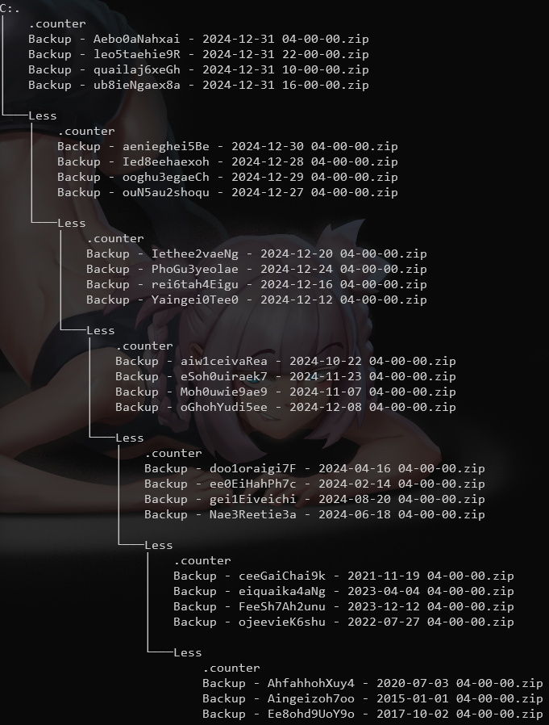

# Logs & Backups Organize Script

## Introduction

This script is designed to manage a directory filled with files, organizing them into subfolders and optionally deleting
older files to keep the directory manageable. This can be especially useful for directories that grow linearly over time
with frequent files, like backups.

## Main Goal

The primary objective of this script is to manage and organize files, such as logs or backups, in a way that ensures
older files are retained less frequently than newer ones.This is particularly useful for systems that generate a large
number of linear growing logs or backup files over time. By implementing this strategy, the script helps in maintaining
a more efficient and manageable file system, where the most recent data is readily available, while older data is
archived or deleted based on predefined criteria.

## Scenario Example

Consider a folder where backup files are created four times per day, every day, for ten years:

```plaintext
.
├── Backup - random - Yesterday 3 am.zip
├── Backup - random - Yesterday 9 am.zip
├── Backup - random - Yesterday 3 pm.zip
├── Backup - random - Yesterday 9 pm.zip
├── Backup - random - Today 3 am.zip
├── Backup - random - Today 9 am.zip
├── Backup - random - Today 3 pm.zip
├── Backup - random - Today 9 pm.zip
```

Without any form of organization, this folder would contain 14,600 files after ten years. However, by using this script,
you can choose to retain only the last 4 files, resulting in significantly fewer files and folders over time.

For example, if you decide to save only the last 4 files, after 10 years, the directory would contain 7 folders and 27
files



**Mathematical Insight:**

The number of subfolders can be approximated using logarithms. Specifically, the number of subfolders required is
roughly the logarithm of the total number of files to the base of the number of files you aim to keep per level (in this
case, 4).

## Usage

```bash
./lg-backup.sh [options] <folder1> <folder2> ...
```

### Options

- `-s, --subfolder-name <name>`
    - Description: Name of the subfolder to move files into.
    - Default: `Less`

- `-c, --counter-file <file>`
    - Description: File to store the counter.
    - Default: `.counter`

- `-m, --file-mask <mask>`
    - Description: File mask to match files.
    - Default: `*.zip`

- `-l, --files-on-level <number>`
    - Description: Number of files to process on each level before moving to subfolder or deleting.
    - Default: `4`

- `-h, --help`
    - Description: Display the help message.

## Using Example

```bash
./lg-backup.sh  -s "Processed" -c ".file_counter" -m "*.log" -l 5 /path/to/directory
```

This command will process .log files in /path/to/directory, moving each fifth file to subfolder named "Processed"
and delete four files between them.
It will also create a file named ".file_counter" in each directory to store the current counter value.
And recursively perform the same action in all "Processed" subdirectories.

## Description

1. Efficient File Management:
    - The script is designed to handle directories with a large number of files, ensuring that the file system remains
      organized and efficient.
    - By moving or deleting files based on their age, it prevents the accumulation of outdated files that can clutter
      the directory and consume unnecessary storage space.
2. Prioritizing Newer Files:
    - Newer files are prioritized and kept more frequently, ensuring that the most recent data is always available for
      quick access.
    - Older files are either moved to subfolders or deleted, depending on the counter's value, which helps in reducing
      the frequency of older files in the main directory.
3. Linear Growth Handling:
    - For systems that generate logs or backups in a linear fashion, this script provides a systematic approach to
      manage the growth.
    - It ensures that as new files are created, they are appropriately managed without overwhelming the file system with
      too many old files.
4. Customizable Parameters:
    - The script allows customization of various parameters such as the subfolder name, counter file, file mask, and the
      number of files to process at each level.
    - This flexibility enables users to tailor the script to their specific needs and file management policies.
5. Recursive Processing:
    - The script can recursively process subfolders, ensuring that the entire directory structure is efficiently
      managed.
    - This feature is particularly useful for complex file systems with multiple levels of directories.

##

By implementing this script, users can achieve a well-organized file system where the oldest files are retained less
frequently than newer ones, making it easier to manage and access important data while keeping storage usage under
control.